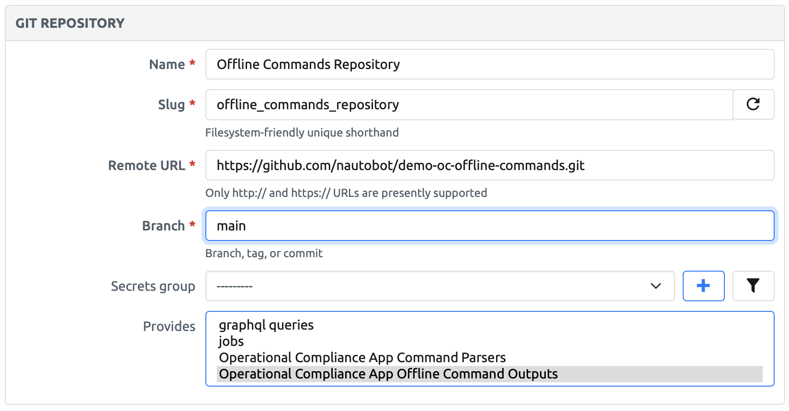
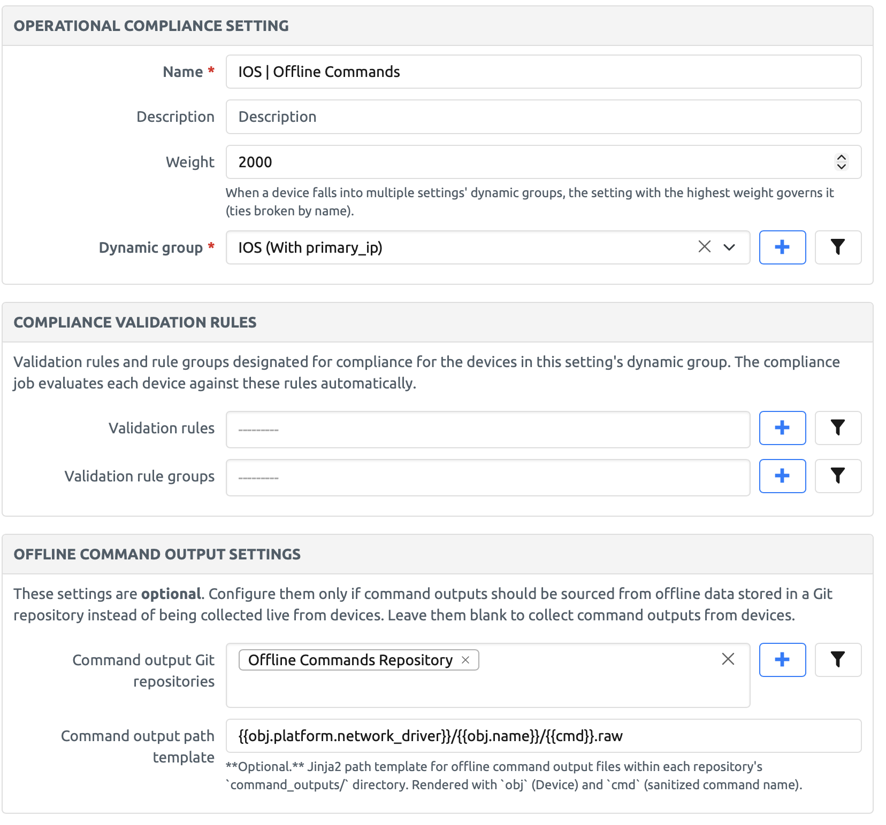

# demo-oc-offline-commands

A demo repository for the [Nautobot Operational Compliance app](https://docs.nautobot.com/projects/operational-compliance/en/stable/) showing how to use the **offline command outputs** feature. Instead of collecting command output live from network devices, the Operational Compliance app can read pre-captured command output files from a Git repository like this one. This repository also provides example **custom command parsers**.

## Repository layout

```
command_outputs/
└── <network driver>/       # Platform network driver, e.g. cisco_ios
    └── <device name>/      # Device name, e.g. 3750-x
        └── <command>.raw   # One file per command or getter
parsers/
└── <network driver>/
    └── <command>.textfsm   # Custom TextFSM parser
```

Offline command outputs live under the `command_outputs/` directory, organized as `<network driver>/<device name>/<command>.raw`, where `<command>` is the command name with spaces replaced by underscores (for example, `show ntp status` becomes `show_ntp_status`).

Custom command parsers live under the `parsers/` directory, organized as `<network driver>/<command>.<parser type>`.

## Using this repository

### 1. Add the Git repository in Nautobot

Navigate to **Extensibility > Git Repositories** and add a new repository:

- **Remote URL**: `https://github.com/nautobot/demo-oc-offline-commands.git`
- **Provides**: select **Operational Compliance App Offline Command Outputs**. If you also want to use the custom parsers from this repository, additionally select **Operational Compliance App Command Parsers**.



### 2. Configure an Operational Compliance Setting

Create (or edit) an Operational Compliance Setting and fill in the **Offline Command Output Settings** section:

- **Command output Git repositories**: select the Git repository you created in step 1.
- **Command output path template**: `{{obj.platform.network_driver}}/{{obj.name}}/{{cmd}}.raw`

The path template is rendered with `obj` (the Nautobot Device) and `cmd` (the command name with spaces replaced by underscores) to locate each output file inside the repository's `command_outputs/` directory. The template above matches this repository's layout.



### 3. Create matching Devices

For the app to find output files for a device, the device's name and platform must match this repository's directory structure. For each device directory under `command_outputs/`, create:

- A **Platform** whose **network driver** matches the top-level directory name (e.g. `cisco_ios`).
- A **Device** assigned to that platform whose name matches the device directory name (e.g. `3750-x`).

Finally, make sure the device is a member of the **dynamic group** associated with the Operational Compliance Setting from step 2 — the app only governs devices in that group.

> **Note:** Configuring one or more command output Git repositories forces offline command collection for every device governed by the setting. There is no fallback to live collection — if an output file is missing for a command, that command fails with a `FileNotFoundError`.

## Custom command parsers

This repository also includes custom TextFSM parsers under `parsers/cisco_ios/` and `parsers/cisco_xe/`. When a validation rule uses the TextFSM parser type, the app checks parser Git repositories first and uses a matching custom template instead of the built-in [ntc-templates](https://github.com/networktocode/ntc-templates) one.

The `cisco_xe` parsers exist because ntc-templates ships no `cisco_xe` templates at all, and the `cisco_xe` network driver is not remapped to `cisco_ios` — without a custom parser, a `cisco_xe` TextFSM rule fails with `No template found for attributes: {'Platform': 'cisco_xe'}`. IOS-XE output for these commands is identical to IOS, so these templates are copies of the equivalent `cisco_ios` templates from ntc-templates.

To use them:

1. Select **Operational Compliance App Command Parsers** in the Git repository's **Provides** field (in addition to the offline command outputs option).
2. That's it — no extra setting is required. By default the app looks for parsers at `parsers/{{obj.platform.network_driver}}/{{cmd}}.<parser type>` within each parser repository, which matches this repository's layout. The path template can be changed via the app's `GIT_PARSERS_PATH` configuration setting.

Note that unlike offline command outputs, the parser path template does not include the device name — parsers are shared by all devices with the same platform network driver.

For more detail on both features, see the [Operational Compliance app documentation](https://docs.nautobot.com/projects/operational-compliance/en/stable/).
